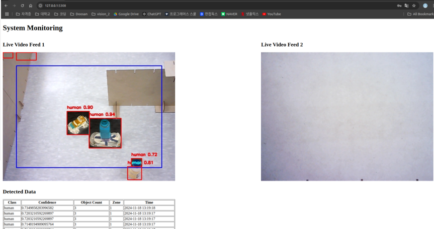

## Description

The images subscribed to from the CCTV of the convention center are processed by YOLO object recognition, and the compressed images and object information are sent to the system monitor node. When three or more people are detected in the bounding box of the screen, the images are captured and saved. The system monitor saves the subscribed object information in the database and displays it on the web screen along with the compressed real-time images through Flask. In addition, the target coordinates of the turtle bot are sent to the AMR bot node so that the AMR bot moves to the corresponding location. During movement, the images of the camera are subscribed to and displayed on the web screen.

## Demo

<p align="center">
  
</p>


## Package Build

```console
cd ~/chob3_ws
colcon build or
colcon build --packages-select expo_bot

source install/setup.bash
```
## How to execute

### 1.CCTV yolo object recognition starts, compresses the image and issues it, and issues object recognition information.

```console
ros2 run expo_bot cctv_detection_node cctv.pt 
```

### 2. In the monitoring system, CCTV video images, robot cam video images are displayed, target coordinates are published, and subscribed object information is stored in the DB.

```console
ros2 run expo_bot sys_monitor_node  
```

### 3. Publish AMR bot's coordinates(Odometry) and video images as a topic 
(remotely connect to Turtlebot, move to the folder, and run)

```console
ros2 run expo_bot amr_control_node 
```

### 4. Initialize location(Init Pose), subscribe to target coordinates and AMR bot coordinates and navigate to the target coordinates 
(remotely connect to Turtlebot, move to the folder, and run)

```console
ros2 run expo_bot navigate_to_goal_node 
```
